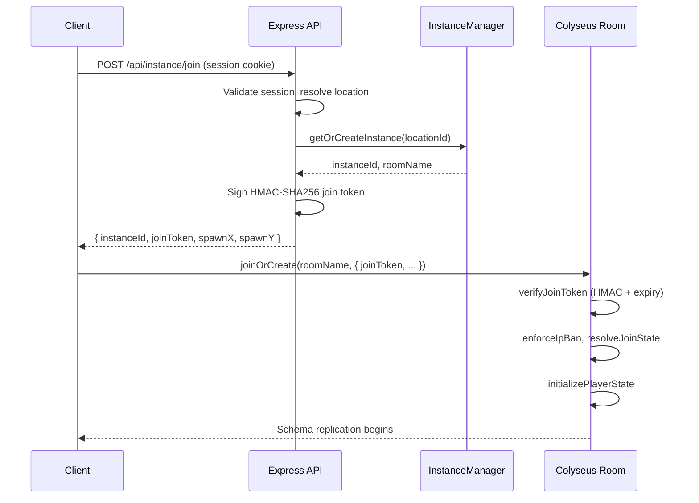

# Cute Fish With Knives (CFWK)

**Create. Battle. Survive.**

Cute Fish With Knives is a free-to-play, real-time multiplayer browser game built entirely from scratch by **Gubby Labs**. Players explore a hand-crafted pixel-art world, catch fish in a skill-based minigame, awaken those fish into combat allies, battle server-authoritative AI enemies, complete branching quest lines, craft consumables, and interact with a living world that cycles through day, night, and seasons -- all in the browser, with zero downloads required. Every system described in this document was designed, architected, and implemented by our team.

---

## Table of Contents

1. [Tech Stack](#tech-stack)
2. [Architecture Deep-Dive](#architecture-deep-dive)
3. [Gameplay Systems](#gameplay-systems)
4. [Multiplayer and Networking](#multiplayer-and-networking)
5. [Visual and Audio Engine](#visual-and-audio-engine)
6. [Authentication and Security](#authentication-and-security)
7. [Item Catalog and Economy](#item-catalog-and-economy)
8. [Premium and Monetization](#premium-and-monetization)
9. [Tooling and DevOps](#tooling-and-devops)
10. [Challenges, Bugs, and Lessons Learned](#challenges-bugs-and-lessons-learned)
11. [What's Next](#whats-next)

---

## Tech Stack

CFWK is a production-grade TypeScript monorepo spanning three workspace packages, each with a clearly defined responsibility.

| Layer | Technology | Purpose |
|-------|-----------|---------|
| **Game Client** | Phaser 3 (Matter.js physics), Pixi.js, Vite MPA, TypeScript | Rendering, physics, input, UI, scene management |
| **Game Server** | Node.js, Express, Colyseus 0.15, TypeScript | Authoritative game state, real-time rooms, REST API |
| **Database** | MongoDB via Mongoose 7 | Persistent player data, inventory, progression, sessions |
| **Auth** | Passport.js (Google OAuth, Discord OAuth), bcrypt | Multi-provider authentication with email/password fallback |
| **Payments** | Stripe | Premium subscriptions, webhook-driven lifecycle |
| **Shared** | `@cfwk/shared` workspace package | Cross-cutting types, item definitions, fishing loot tables, world time math |
| **Monorepo** | npm workspaces, concurrently | Unified dev experience, single `npm run dev` starts everything |

**Noteworthy technical highlights:**

- **Service Worker Asset Pipeline** -- a custom cache-first service worker manages game assets with versioned cache busting, mobile-aware "safe mode" for low-spec devices, and a manifest-driven warm-up strategy that pre-caches critical assets on first load.
- **CRT Post-Processing Shader** -- a global Phaser pipeline plugin (phaser3-rex-plugins CRT) renders the entire game through a retro CRT scanline filter, togglable per user settings.
- **A\* Pathfinding Engine** -- a fully custom A\* implementation with diagonal corner-cut support and straight-line path compression powers all server-side AI navigation.
- **HMAC-SHA256 Join Tokens** -- cryptographically signed, time-limited tokens gate every WebSocket connection, preventing unauthorized room entry.
- **Pixi.js Fishbowl** -- the launch page features an entirely separate Pixi.js 8 application rendering an interactive animated fishbowl, decoupled from the Phaser game runtime.

---

## Architecture Deep-Dive

### Client-Server Split

CFWK follows a strict authoritative-server model. The client handles rendering, input collection, and prediction; the server owns all game state, validates every action, and replicates state to connected clients. Nothing the client sends is trusted without server verification.

### Instance Sharding

The `InstanceManager` singleton on the server handles dynamic instance allocation across map locations. When a player requests to join a location:

1. The manager finds the least-loaded instance with remaining capacity.
2. If all instances for that location exceed a **75% fill threshold**, a new instance is automatically spun up.
3. Empty non-lobby instances are kept alive for **5 minutes** before graceful teardown, preventing churn from players briefly disconnecting.
4. Duplicate connections are tracked per user (`odcid`) -- if a player is already connected elsewhere, the system enforces a single-session policy.

### Join Handshake

No client can connect to a game room without first passing through a secure REST handshake:

The join token encodes the user ID, instance ID, location ID, room name, and an expiration timestamp. It is signed with a dedicated secret (or falls back to the session secret) and verified on every room join attempt. Expired or tampered tokens are rejected immediately.

### Movement Authority

Player movement uses a **client-prediction with server-reconciliation** model:

- The client sends **movement frames at 20 Hz** containing position, velocity, input state, animation, and a sequence number.
- The server maintains a **position history buffer** per player and computes discrepancy against the client's reported position.
- If discrepancy is below the **soft threshold**, the server silently accepts the client position.
- If discrepancy exceeds the **soft threshold** but stays under the **hard threshold**, the server sends a gentle **reconciliation nudge** that the client blends toward.
- If discrepancy exceeds the **hard threshold**, the server forcibly snaps the player to the authoritative position.
- All thresholds are **latency-aware** -- players on higher-latency connections get slightly more generous windows to prevent false corrections.

### Simulation Tick Loop

The server runs a fixed-timestep simulation loop at a configurable tick rate. Each tick executes four phases in order:

1. **Hard Authority Motion** -- processes any server-initiated movement (impulses from shoves, knockback, defeat teleports).
2. **AI NPC Simulation** -- runs the AI controller `update()` for every living enemy, handling chase logic, pathfinding, and melee attack scheduling.
3. **Soft Entity Collisions** -- applies gentle separation forces between all players and AI entities to prevent overlap, using configurable foot-hitbox radii and force constants.
4. **Enemy Spawning** -- checks spawn regions against their `maxSpawned` cap and `restoreRate` timers, spawning new enemies at validated random positions within Tiled polygon regions.

### State Replication Strategy

CFWK uses a **hybrid replication model**:

- **Colyseus Schema** (continuous replication): player positions, velocities, animations, AI NPC state, dropped items, world time. These change frequently and benefit from delta-compressed automatic sync.
- **Room Messages** (event-driven): inventory updates, hearts/money changes, quest progression, glimmerbowl events, fishing state, chat. These are discrete events that don't need continuous replication.

This split keeps schema bandwidth low while ensuring transactional game events are delivered reliably.

---

## Gameplay Systems

### Fishing Minigame

Fishing is the core progression mechanic and runs in its own dedicated Phaser scene (`FishingScene`), completely separate from the world renderer for clean state isolation.

**The fishing loop:**

1. **Cast** -- the player holds to charge cast depth (1-12 meters). Deeper water yields rarer catches but requires better timing.
2. **Wait** -- a randomized bite timer runs. The player watches for the visual and audio bite alert.
3. **Hook** -- on bite, the server rolls the loot table considering the water region, cast depth, equipped rod stats, and bait modifiers. A `clicksRequired` value is computed from the fish's mass and the rod's strength.
4. **Reel** -- the player must click/tap to reel in the fish, completing the required clicks within a timing window.
5. **Catch** -- the server awards the item to the player's inventory (or Glimmerbowl if unlocked and the catch is a fish). If inventory is full, the item drops to the ground.

**Loot table mechanics:**

The fishing loot system uses a multi-factor weighted random selection:

- Each loot entry has a base weight, minimum rod tier gate, optional bait requirement, and ideal depth.
- `calculateEffectiveWeight` applies a **depth curve** (catches near their ideal depth are more likely), **rod tier gating** (some fish require better rods), and a **rarity multiplier** from the rod's `rarityMultiplier` stat.
- The system supports 7 rarity tiers: Common, Uncommon, Rare, Epic, Legendary, Mythic, and Supreme.

The tutorial system can override loot selection to guarantee a Salmon on the player's first catch, ensuring a smooth onboarding experience.

### Glimmerbowl (Fish Combat)

The Glimmerbowl is CFWK's signature combat system -- a progression-unlocked feature where caught fish become living combat allies.

**How it works:**

1. **Collection** -- fish caught while fishing are stored in the player's Glimmerbowl (a persistent fish collection separate from inventory).
2. **Awakening** -- players can use rare **Nightfire Scar** items to awaken a fish, transforming it from a collectible into a combat-ready ally with full stats.
3. **Launch** -- in combat, the player aims and launches an awakened fish at a ground target. The server computes a ballistic arc trajectory and broadcasts the launch event to all clients.
4. **Impact** -- when the fish lands, the server calculates **AoE damage** against all nearby AI enemies. Damage is derived from the fish's base stats (damage x4 base multiplier) with a critical hit roll based on `critRate` and `critDamage`.
5. **Knockback** -- hit enemies receive a knockback impulse proportional to the impact, interrupting their current behavior.
6. **Return** -- after impact, a return event fires and the fish becomes available for re-launch after a cooldown.

Every fish species has unique combat stats:

| Stat | Role |
|------|------|
| Damage | Base hit power |
| Speed | Launch velocity / cooldown |
| Energy | Number of launches before rest |
| Crit Rate | Probability of critical hit (2-3.2%) |
| Crit Damage | Critical hit multiplier (1.25x-1.38x) |

The Glimmerbowl is unlocked through the **"Bowl That Shines"** quest chain, which requires players to fish at a specific location during nighttime hours (23:00-04:00 game time), find a Glimmering Key, and open a hidden chest.

### PvE Combat

CFWK features fully server-authoritative enemy AI with no client-side simulation:

**Enemy Types:**
- **Gremlins** -- fast, aggressive pack enemies that spawn from Tiled polygon regions. They use horizontal-only facing (left/right) and have custom hitboxes derived from sprite trim metadata at server startup.
- **Evil Tim** -- a tougher, named enemy with different stats and behavior tuning.

**AI Controller (`GeneralEnemyController`):**

The AI operates on a simple but effective two-mode brain:

- **Idle Mode** -- enemies wander randomly within their spawn region. Gremlins use a fixed-distance wander pattern with tick-gated re-rolls for natural-looking movement.
- **Chase Mode** -- when a player enters the `chaseRangeMeters` radius, the enemy switches to pursuit. It periodically recalculates an **A\* path** through the nav grid and follows waypoints using `resolveMovement` (axis-separated slide against collision shapes).

**Melee Attack System:**

Attacks use a **wind-up / impact** timing model:

1. The enemy enters attack range and begins a wind-up animation.
2. After the wind-up delay, the impact check fires -- if the player is still in melee range, damage is applied.
3. The player can **dodge** during the wind-up window using i-frame mechanics tracked on the movement runtime.
4. Successful hits apply configurable heart damage and a knockback impulse.

**Defeat and Recovery:**

When a player's hearts reach zero, they enter a defeat state. The server clears all AI aggro on that player, persists the state, and broadcasts a defeat event. Recovery restores hearts and repositions the player.

**Navigation:**

The `ServerMapNavService` loads Tiled maps at room creation, extracts collision shapes from layers marked as `Collidable` or containing "collision"/"avoidance" in their name, and builds a blocked-cell grid. The custom A\* implementation supports diagonal movement with corner-cut prevention and outputs compressed paths (straight-line simplification) to minimize waypoint count.

### Quest and Progression System

CFWK features a branching quest graph with dependency chains, multiple objective types, and deep NPC integration.

**Quest Catalog:**

| Quest | Dependency | Key Objectives |
|-------|-----------|----------------|
| **First Catch** | None | Talk to the Fisherman, catch your first fish |
| **Heed the Warning** | First Catch | Talk to the Guard, survive 60 seconds in the Danger region |
| **Anti-Death Measures** | First Catch | Talk to the Merchant, harvest a Yek Bush |
| **Merchant's Side Brew** | Anti-Death Measures | Refine yekberries into juice, bottle the liquid with a jar |
| **Village Weirdo** | Heed the Warning + Anti-Death Measures | Collect 5 Yek Berries for the Traveller |
| **Wares Galore** | Village Weirdo | Side quest from the Merchant |
| **Bowl That Shines** | Village Weirdo | Talk to the Wiseman and SeaMaster, fish at a key location during night hours, find the Glimmering Key, open the Glimmering Chest |

**Objective Types:**

The quest system supports 9 distinct objective kinds, each with its own validation logic:

- `talk-to-npc` -- interact with a specific NPC
- `fish-catch` -- catch any fish
- `fish-near-location` -- catch a fish within a radius of a named map point
- `stay-in-region` -- remain inside a named Tiled polygon for a duration (resets on exit)
- `harvest-interactive` -- interact with a world harvestable (bushes, chests)
- `refine-food` -- walk near a dropped item to trigger proximity-based refinement
- `bottle-liquid` -- collect a ground liquid into a container
- `wait-for-time-window` -- requires a specific in-game time range (e.g., night hours)
- `inventory-count` -- accumulate a required quantity of a specific item

**Guided Tutorial:**

New players are guided through a structured tutorial state machine (`IGuideTutorialState`) that teaches rod equipping, casting, reeling, food consumption, and healing. The tutorial can force specific outcomes (guaranteed Salmon catch) and blocks certain inputs until the player completes each step. A `GuideOverlay` + `GuideCoordinator` + `GuideInputGate` trio manages the UI and input flow.

**Additional Progression:**

- **Region Discovery** -- visiting named map regions (e.g., "Coast Town" in Anchor Hollow) triggers discovery entries tracked per player.
- **Achievements** -- a catalog of fun achievements (e.g., "Campfire Stories") with expandable categories.
- **Player Statistics** -- persistent tracking of `distanceWalked`, `distanceRan`, `timeOnlineMs`, `catches`, and `npcInteractions`, with server-computed leaderboard ranks delivered via a dedicated stats API.
- **Advancement Alerts** -- quest completions, region discoveries, and achievements trigger in-game alert banners with themed sound effects.

### Crafting and Refinement

Rather than a traditional crafting grid, CFWK uses a unique **proximity-based refinement** system:

1. **Drop Refinement** -- when a player walks near a dropped item that matches a refinement recipe (e.g., Yek Berries), a `refinementProgress` counter increments with each proximity tick. Once `requiredSteps` is reached, the item transforms (Yek Berries become Yek Juice Liquid).
2. **Liquid Collection** -- ground liquids can be collected using container items. Walking near Yek Juice Liquid with a Jar in inventory produces bottled Yek Juice, a significantly more potent healing consumable.

This system creates emergent gameplay where players must physically interact with the world to craft, rather than opening a menu.

### Inventory and Economy

**Inventory:**

- Players have a configurable number of inventory slots plus dedicated equipment slots for a fishing rod and usable items.
- The server maintains an **`InventoryCache`** -- an in-memory cache per user that dirty-flushes to MongoDB on a 5-minute interval and on server shutdown, balancing write performance with durability.
- Every `inventory:set` message from the client is validated by the **`InventoryAuthority`** -- the server checks item definitions, stack sizes, and enforces **mass conservation** (items cannot be created or destroyed through inventory manipulation, only through legitimate game actions).
- Equipment changes are validated by the **`EquipmentAuthority`** with additional tutorial-aware patches for onboarding players.

**Economy:**

- Enemies drop coins on death, computed from loot tables with denomination tiers and jackpot rolls.
- Coin pickups are tracked in a per-user `moneyByUserId` map and persisted to the database.
- The `GET /api/money` endpoint returns the player's current balance as an `IPlayerMoneyState`.

### World Time

CFWK runs an accelerated world clock that creates a living, breathing game world:

- **1 real-world minute = 1 game hour** (15 real minutes = 1 full game day).
- **4 seasons** cycle through the year, each with configurable daylight hours affecting sunrise/sunset timing.
- **Brightness** transitions smoothly between day and night with configurable dawn/dusk ramp periods.
- The world time is computed from a fixed epoch and replicated via Colyseus schema so all connected clients stay perfectly synchronized.

**Seasonal Effects:**

The `SeasonalEffectsManager` applies season-specific visual layers:

- Snowfall particles in winter
- Petal/blossom particles in spring
- Dust motes in summer
- Falling leaves in autumn
- Season-appropriate color tints on the world

### NPCs and Dialogue

CFWK features 8 hand-crafted NPCs, each with unique dialogue trees and quest integration:

| NPC | Role |
|-----|------|
| **Fisherman** | Tutorial guide, teaches fishing basics |
| **Guard** | Warns about the Danger region, quest-giver |
| **Merchant** | Sells supplies, teaches crafting/refinement |
| **Wiseman** | Mysterious elder, initiates the Glimmerbowl quest chain |
| **SeaMaster** | Master of the sea, key figure in the Glimmerbowl storyline |
| **Traveller** | Wandering stranger, requests items from players |
| **Test NPC** | Development/testing purposes |
| **Debug NPC** | Admin-only debug interface |

**Dialogue System:**

- Dialogue trees are stored as **static JSON files** under `client/public/dialogue/` (e.g., `wiseman.json`, `seamaster.json`).
- The `DialogueManager` loads dialogue on NPC interaction, evaluates branching conditions (item checks, quest state), and drives the `DialogueUI` with typewriter-style text rendering.
- Dialogue can be **quest-integrated** -- completing a dialogue tree fires `npc:interact` to the server, which increments the `npcInteractions` stat and triggers advancement checks.
- A **subtitle system** (`SubtitleStack`) can display ambient dialogue with locale-aware translations.

---

## Multiplayer and Networking

### Room Architecture

Every game world instance runs as a **Colyseus room** with schema-based state replication:

- **`InstanceRoom`** -- the primary game room, filtered by `instanceId` and `locationId` so `joinOrCreate` correctly routes players to the right shard.
- **`GameRoom`** -- a legacy/demo room with simplified state (kept for reference).

The room lifecycle is managed by a suite of dedicated services following a clean separation-of-concerns architecture (documented in the codebase's own `ARCHITECTURE.md`):

| Service | Responsibility |
|---------|---------------|
| `JoinLifecycleService` | Token verification, join orchestration |
| `JoinStateResolver` | IP ban, account ban, access checks, duplicate detection, user snapshot loading |
| `JoinPayloadService` | Initial state payloads (inventory, hearts, money, advancements) |
| `LeaveDisposeService` | Position persistence, cleanup, instance manager notification |
| `MovementMessageService` | Client frame processing, reconciliation, shove handling |
| `AiSimulationService` | AI spawning, pathing, combat, loot drops |
| `WorldTimeService` | Clock ticks, AFK kicks, drop cleanup, stats broadcasting |
| `ChatService` | Chat message routing |
| `GameplayItemHandlersService` | Fishing, harvesting, inventory sync, glimmerbowl |
| `DroppedItemsService` | Ground items, proximity refinement |
| `GlimmerbowlService` | Fish launches, combat resolution |
| `PlayerStateService` | Hearts, money, stats deltas |
| `ProgressionService` | Quest/advancement hooks |
| `AdminService` | Live admin commands bridged from InstanceManager events |
| `DebugNpcService` | Debug-only NPC interactions |

### Remote Player Interpolation

Other players' avatars are rendered using a sophisticated **interpolation buffer** system:

- Server position snapshots are pushed into a time-stamped buffer.
- The render timestamp is offset by an **adaptive delay** that accounts for network jitter.
- Positions are interpolated using **Hermite-style** curves between samples for smooth, natural-looking movement.
- Short **extrapolation** covers gaps when packets arrive late.
- If interpolation error exceeds a threshold, a **smooth snap** blends rapidly to the correct position rather than teleporting.

### Shove Mechanic

Players can shove other players as a social/competitive interaction:

- The server validates distance (within 60px), performs a **latency-rewind check** using position history snapshots to account for network delay, and applies a server-authoritative impulse to the target.
- Shove events trigger animations on both the attacker and target, with particle effects for impact feedback.

### Connection Resilience

- **Duplicate connection prevention** via `odcid` (owner document connection ID) tracking ensures one session per account across all instances.
- **Disconnect modals** on the client gracefully handle WebSocket drops with retry prompts.
- **Server transfer** messages allow seamless instance migration when load balancing requires it.

---

## Visual and Audio Engine

### Rendering

CFWK's visual presentation is built on Phaser 3 with pixel-art-first rendering:

- **`pixelArt: true`** and **`roundPixels: true`** ensure crisp, non-blurry sprites at any zoom level.
- **Tiled Map Integration** -- maps are authored in Tiled and exported as `.tmj` JSON. The `MapLoader` parses layers, tilesets, and object groups; the `TileAnimationManager` drives animated tiles (water shimmer, flickering torches).
- **Depth System** -- a `DepthManager` with configurable `DepthBands` ensures proper Y-sorted rendering. Players walk behind trees, NPCs layer correctly against buildings, and dropped items sit on the ground plane.
- **Occlusion System** -- the `OcclusionManager` fades or hides foreground objects when they would obscure the player, maintaining visual clarity in dense environments.
- **CRT Shader** -- a global post-processing pipeline applies CRT scanlines, barrel distortion, and vignette for a retro aesthetic. Fully togglable in the settings panel.

### Particle Systems

Four distinct particle systems add environmental life:

- **`WaterSystem`** -- splash particles on entry/exit, speed reduction while wading, depth-based visual effects.
- **`FireParticleSystem`** -- campfire/torch particles with distance-based audio volume attenuation.
- **`DustParticleSystem`** -- ambient dust motes and terrain-kicked particles during movement.
- **`SeasonalEffectsManager`** -- season-driven atmospheric particles (snow, petals, leaves, summer dust) with world-tint color grading.

### Lighting

The `LightingManager` integrates with the world time system to apply dynamic brightness:

- Dawn and dusk transitions use smooth easing curves.
- Night scenes are significantly darker, creating atmosphere and tying into the time-gated quest mechanics (fishing at night for the Glimmering Key).
- The `FishingScene` inherits world lighting so the fishing minigame reflects the current time of day.

### Audio

The `AudioManager` provides a layered, context-aware audio experience:

- **Per-Map Configs** -- each location defines its own music track, ambient layers (ocean waves, forest sounds), and fire sound sources with spatial volume falloff.
- **Surface-Aware Footsteps** -- the system detects tile material (sand, grass, stone, wood) and plays appropriate footstep sounds, with water-depth filtering when wading.
- **Fishing SFX** -- cast whoosh, splash, bite alert, reel click feedback, and catch fanfare.
- **Quest/Achievement Audio** -- distinct sound effects for quest completion, region discovery, and advancement alerts.
- **Dialogue Muffle** -- ambient audio ducks during NPC dialogue for cinematic focus.
- **User Settings Integration** -- all audio respects the player's volume settings, applied in real-time without requiring a restart.

### Launch Page Fishbowl

The pre-game launch page features a standalone **Pixi.js 8** application rendering an interactive fishbowl with animated fish sprites, independent of the Phaser game runtime. This was built as a separate rendering context to avoid loading the full game engine just for a decorative lobby element. Players can toggle it via localStorage preference.

---

## Authentication and Security

### Authentication Flow

CFWK supports three authentication methods:

1. **Email/Password** -- registration with bcrypt-hashed passwords, email verification via token + Nodemailer, password reset flow with cooldown protection.
2. **Google OAuth** -- Passport.js strategy with account linking support for existing email accounts.
3. **Discord OAuth** -- Passport.js strategy with optional Discord guild auto-join via bot token, plus account linking.

Sessions are managed via `express-session` with `connect-mongo` as the store (7-day TTL). OAuth users are automatically marked as verified.

### Security Layers

- **HMAC-SHA256 Join Tokens** -- every WebSocket room connection requires a cryptographically signed token issued by the REST API, with a configurable TTL (minimum 15 seconds). Tokens encode user ID, instance ID, location ID, and room name.
- **IP Ban System** -- the `BannedIP` model supports time-limited IP bans enforced at room join. Banned IPs are checked before any game state is loaded.
- **Account Ban** -- user-level bans with separate access flags (`access.game`, `access.maps`) and beta access windows (`betaAccessUntil`).
- **Inventory Validation** -- the `InventoryAuthority` cross-references every client inventory update against server-side item definitions, enforcing stack sizes and mass conservation to prevent duplication exploits.
- **Admin Command Processor** -- privileged users with `game.admin` permissions can execute in-game commands (ban, teleport, spawn, inventory manipulation). Every command is written to a persistent audit log (`server/logs/commands.log`) via the `CommandAuditLogger`.
- **Username Validation** -- dedicated validation utilities prevent inappropriate or malformed usernames.
- **CORS Policy** -- configurable origin allowlist with production domain hardcoding plus environment-variable overrides.

---

## Item Catalog and Economy

### Item Categories

CFWK features a rich item catalog with 6 categories and 7 rarity tiers spanning 25+ unique items:

**Food:**

| Item | Rarity | Healing | Description |
|------|--------|---------|-------------|
| Golden Berries | Rare | -- | A rare, sweet berry that restores vitality |
| Yek Berries | Common | Low | Tiny tart berries from a yek bush |
| Yek Juice | Uncommon | High | Pressed yek juice, a much stronger heal |

**Fish (11 species):**

| Species | Rarity | Damage | Speed | Energy | Crit Rate | Crit Dmg |
|---------|--------|--------|-------|--------|-----------|----------|
| Tuna | Common | 5 | 6 | 6 | 2.0% | 1.25x |
| Mackerel | Common | 4 | 7 | 5 | 2.0% | 1.25x |
| Cod | Common | 5 | 5 | 6 | 2.0% | 1.25x |
| Salmon | Common | 6 | 5 | 6 | 2.5% | 1.30x |
| Catfish | Common | 5 | 4 | 7 | 2.0% | 1.25x |
| Fat Tuna | Uncommon | 7 | 6 | 7 | 3.0% | 1.35x |
| Fat Mackerel | Uncommon | 6 | 7 | 6 | 3.0% | 1.35x |
| Fat Cod | Uncommon | 7 | 5 | 7 | 3.0% | 1.35x |
| Fat Salmon | Uncommon | 8 | 5 | 7 | 3.2% | 1.38x |
| Fat Catfish | Uncommon | 7 | 4 | 8 | 3.0% | 1.35x |
| Coho Salmon | Uncommon | 7 | 6 | 7 | 3.0% | 1.35x |

**Tools:**

| Item | Rarity | Speed Mult | Rarity Mult | Strength |
|------|--------|-----------|-------------|----------|
| Rickety Rod | Common | 0.75x | 0.4x | 0.5 |
| Fisherman's Rod | Uncommon | 0.75x | 0.5x | 0.75 |

**Junk (7 items):** Sea Grass, Old Boot, Broken Bottle, Apple Core, Trash Bag, Sea Pickle, Broken Spectacles -- common catches that add variety and humor to the fishing loot pool.

**Treasure:** Infested Boot, Infested Vase, Ruined Chest -- uncommon/rare finds with higher value. Plus the quest-critical **Glimmering Key** (rare, stackSize 1).

**Special Items:**

- **Nightfire Scar** (Legendary) -- *"A burning sigil that can awaken a fish into free will."* Used to awaken Glimmerbowl fish for combat.
- **Jar** (Common tool) -- used for liquid collection in the crafting system.
- **Yek Juice Liquid** (Loot) -- intermediate crafting material from proximity refinement.

### Rarity Tiers

The rarity system spans 7 tiers, each affecting drop rates, visual presentation, and item power:

**Common** > **Uncommon** > **Rare** > **Epic** > **Legendary** > **Mythic** > **Supreme**

---

## Premium and Monetization

CFWK integrates **Stripe** for a premium subscription tier:

- **Checkout Flow** -- server-generated Stripe checkout sessions with configurable return URLs.
- **Subscription Management** -- cancel and resume endpoints, with webhook-driven lifecycle updates (`POST /api/stripe/webhook` with raw body parsing for signature verification).
- **Premium Perks** -- premium subscribers receive visual badges in chat and on nameplates, extended AFK thresholds before auto-kick, and are flagged in the Colyseus player schema for client-side visual treatment.
- **Beta Access** -- a separate beta access system with 8-digit redeemable codes managed through a Discord bot and dedicated MongoDB collections (`BetaCampaign`, `BetaClaim`).

---

## Tooling and DevOps

### Asset Pipeline

A custom multi-stage asset pipeline ensures efficient delivery:

1. **`bump-asset-version.js`** -- semver-bumps `asset-version.json` at the repo root, which drives cache-bust keys across the service worker and REST asset API.
2. **`generate-game-assets-manifest.js`** -- scans `client/public/` for assets under configured prefixes (`assets/`, `audio/`, `dialogue/`, `items/`, `maps/`, `ui/`, `packs/`) and generates a `game-assets.manifest.json` used by the service worker for pre-caching.
3. **`pad-tilesets.js`** -- uses **Sharp** to pad Tiled tilesets with transparent borders, eliminating the common "tile bleeding" artifact in Phaser's WebGL renderer.
4. **`strip-tmj-prefix.js`** -- rewrites asset paths inside `.tmj` map files when migrating between development and production environments.

### Discord Bot

A standalone Discord.js bot (`server/bot/index.ts`) manages beta campaign administration:

- Create and manage beta campaigns with configurable claim limits.
- Generate and distribute beta access codes.
- Track code redemptions with user attribution.
- Integrates with the same MongoDB backend as the game server.

### Monitoring and Administration

- **Colyseus Monitor** -- mounted at `/colyseus` for real-time room inspection, player counts, and performance metrics.
- **Admin Command Processor** -- in-game chat commands for privileged users: ban/unban, teleport, spawn items/enemies, wipe inventories. All actions are audit-logged.
- **News CMS** -- a lightweight news system with CRUD endpoints and file upload support (`multer` + `sharp` for image processing) for in-game announcements.
- **Character Appearance Migration** -- a dedicated migration script (`tools/migrate-character-appearance.ts`) for schema evolution of player appearance data.

### Multi-Page Application

The client is built as a **Vite MPA** with custom middleware rewrites, serving 15+ distinct HTML entry points from a single build:

`/game`, `/play`, `/login`, `/register`, `/account`, `/skin`, `/launch`, `/maps`, `/admin`, `/logs`, `/onboarding`, `/forgot`, `/reset`, `/verify`, `/upgrade`, `/ad`, and more -- each with its own TypeScript entry point and independent functionality, unified by shared CSS and UI components.

---

## Challenges, Bugs, and Lessons Learned

Building a real-time multiplayer game from scratch in the browser taught us more than any tutorial ever could. Here are the hardest problems we faced:

### Authoritative Movement vs. Responsiveness

The single hardest engineering challenge was making movement feel instant on the client while preventing cheating on the server. Our first implementation had no server reconciliation, which meant speed hacks were trivial. Our second implementation was too aggressive with corrections, causing rubber-banding on even moderate latency connections. We iterated through multiple reconciliation strategies before landing on the current **dual-threshold system** (soft nudge vs. hard snap) with **latency-adaptive windows**. Even now, edge cases with sudden latency spikes can cause brief visual artifacts -- it's a problem with no perfect solution, only better tradeoffs.

### Instance Lifecycle Management

Managing dynamically created and destroyed game instances turned out to be far more complex than anticipated. Early versions would orphan rooms when the last player disconnected during a server-side async operation, leaking memory. The 5-minute delayed teardown was added after players complained about losing their position when briefly disconnecting to switch tabs. Duplicate connection detection across instances required a global registry that had to be carefully synchronized -- race conditions between join and leave events in different rooms caused "ghost player" bugs that took days to track down.

### AI Pathfinding on Tiled Maps

Converting Tiled map collision data into a navigable grid for A\* was deceptively tricky. The initial implementation treated collision polygons as simple bitmask cells, but this caused AI to get stuck on diagonal wall corners. We had to implement **corner-cut prevention** in the A\* algorithm and add **axis-separated slide movement** in `resolveMovement` so enemies could smoothly navigate around obstacles. The gremlin-specific challenge was even worse: their sprite trim metadata (used for efficient texture atlases) meant the visual hitbox didn't match the collision hitbox. We ended up loading `trim.meta.json` at server startup to dynamically recalculate gremlin hitbox dimensions from idle frame data.

### Fishing Loot Table Balancing

The fishing loot math went through many iterations. The first version was purely random, which felt unrewarding. We added depth weighting, rod tier gating, and rarity multipliers one at a time, each introducing new edge cases. The depth curve alone required careful tuning -- too steep and only one depth matters, too flat and depth is irrelevant. The interaction between rod `rarityMultiplier`, item rarity, and `idealDepth` creates a complex probability space that was difficult to balance by intuition alone.

### Service Worker Cache Invalidation

The service worker asset caching strategy caused some of our most frustrating bugs. Early versions would serve stale game assets after deployments, causing version mismatch errors between client code and server expectations. Our solution was a **versioned cache scheme** -- the asset version is checked against `localStorage` on every page load, and a `SET_ASSET_VERSION` message to the service worker triggers a full cache rotation. Mobile devices added another dimension: some low-spec phones would run out of memory during the pre-cache warm-up, so we implemented a **"safe mode"** that caches fewer assets with lower concurrency.

### Real-Time Inventory Synchronization

Preventing inventory duplication exploits while maintaining a responsive UX was a constant battle. The **mass conservation** check in `InventoryAuthority` was born from a bug where rapidly swapping items between slots could temporarily create duplicate stacks. The in-memory `InventoryCache` with periodic flush was a performance optimization that introduced its own risks -- a server crash between flushes could lose up to 5 minutes of inventory changes. We added a shutdown hook to flush all dirty caches, but ungraceful crashes (OOM, power loss) remain a theoretical data loss window.

### Schema vs. Message Replication Decisions

Choosing what goes in Colyseus schema (continuous replication) vs. room messages (event-driven) was more nuanced than it seemed. Putting everything in schema caused excessive bandwidth from delta encoding on fields that rarely change. Putting everything in messages meant we lost automatic state recovery on reconnect. We settled on a hybrid: high-frequency positional data in schema, transactional game events as messages. This means a reconnecting player gets positions immediately from schema but needs explicit initial payload messages for inventory, hearts, money, and progression state.

### Cross-Platform Input

Supporting both desktop (keyboard + mouse) and mobile (virtual joystick + touch) from a single codebase required abstracting input at every level. The `MCInputManager` normalizes both input sources into the same `MovementInputState`, but edge cases abound: mobile interaction prompts need larger touch targets, the chat input steals keyboard focus on desktop but needs a dedicated mobile variant, and fullscreen management behaves differently across mobile browsers. The `GuideInputGate` for the tutorial had to account for both input modes without breaking either.

### World Time Synchronization

Getting all connected clients to agree on the current game time sounds simple -- compute from a shared epoch -- but in practice, clock drift between the server and client `Date.now()` caused visible disagreements in day/night transitions. The solution was to replicate world time in the Colyseus schema (updated every second by the server), so clients always reference the server's authoritative time rather than computing their own.

### CRT Shader Performance

The CRT post-processing effect looks great but has a real GPU cost. On integrated graphics and older mobile devices, enabling the CRT pipeline dropped frame rates below acceptable thresholds. We made it fully togglable in the video settings panel and default it to off on detected low-performance devices, but the detection heuristic is imperfect -- some capable devices get classified as low-spec and vice versa.

---

## What's Next

CFWK is designed for expansion. The architecture already has hooks for features on our roadmap:

- **Multiple Map Locations** -- water regions for tropical, arctic, deep ocean, and freshwater are defined in the shared loot table schema with empty-but-ready table stubs, awaiting map art and region-specific fish species.
- **New Enemy Types** -- the `AI_NPC_DEFINITIONS` registry and `AIController` interface are built for polymorphism. New enemy kinds only require a definition entry and an optional custom controller.
- **Full Shop/Vendor System** -- the Merchant NPC and coin economy are in place; a transactional buy/sell UI is the next step.
- **Expanded Quest and Achievement Catalogs** -- the branching quest graph and 9 objective types can scale to dozens of quests without architectural changes.
- **Additional Fishing Rods and Bait** -- the rod tier and bait gating systems are fully implemented but currently only populated with two rod tiers. Higher-tier rods will unlock access to rarer fish in deeper waters.

---

*Built with late nights, too much coffee, and an unreasonable number of fish puns by Gubby Labs.*
